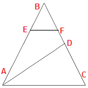
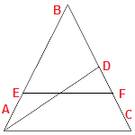
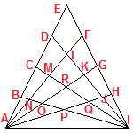
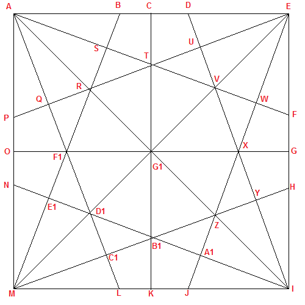
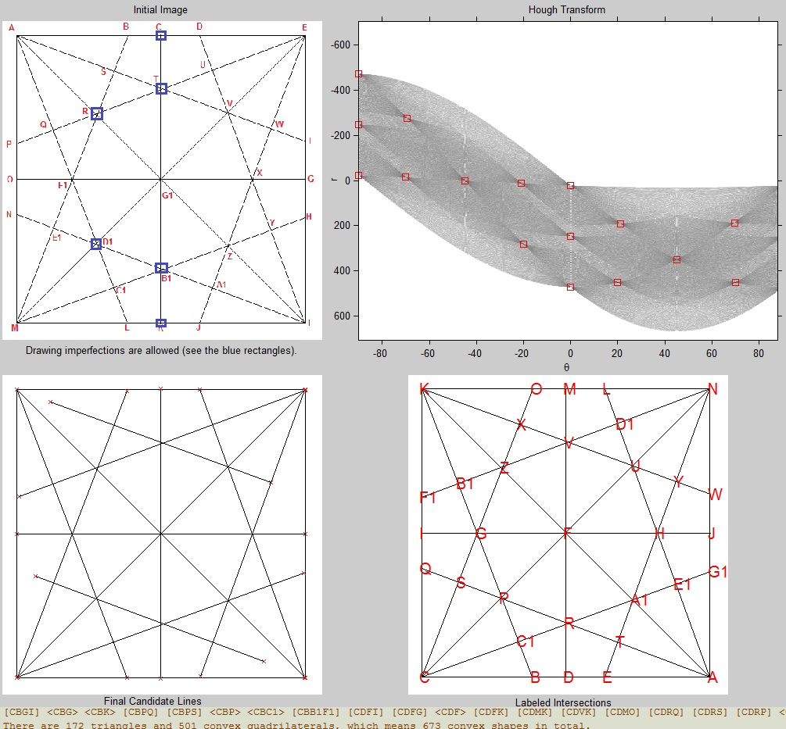

### Counting triangles and quadrilaterals within geometric figures traversed by a number of lines

* * *

The exact mathematical relations providing the count of those shapes within a figure are quite difficult to infer for complex figures. So this tool can be used as a validator for such relations.

[Matlab/Octave implementation](Matlab_Octave/) provides also support for **directly reading/interpreting the figures from images** which might contain *drawing imperfections* (see last image from the page).

The problem is also a good refresher for parallelism techniques (implemented by now in C++ based on [OpenMP](http://www.openmp.org/)). [CUDA](https://en.wikipedia.org/wiki/CUDA) / [OpenCL](https://www.khronos.org/opencl/) might be other valid options for solving this problem in a parallel fashion.

These are the tested figures:

Below are several steps performed while interpreting the figures. The initial intersection labels are ignored and new ones are assigned.

The array of reported shapes was truncated. Convex quadrilaterals are represented using 4 labels inside **&#91;&#93;**, while triangles have only 3 labels inside **&#60;&#62;**. The labels are the ones assigned by the program and not those from the original image.

* * *

&copy; 2017 Florin Tulba (florintulba@yahoo.com)
