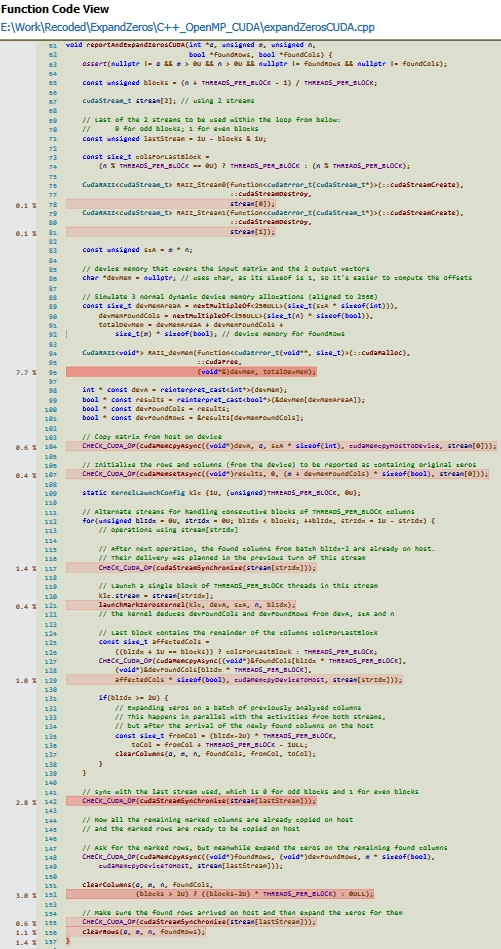
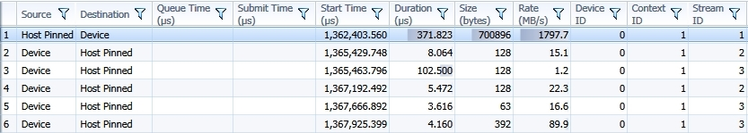

### Expanding the zeros found in a matrix on the corresponding rows and columns

* * *

Using parallelism and concurrency was the motivation behind checking this problem.

The C++ implementation provides:

- an algorithm that uses [CUDA](https://en.wikipedia.org/wiki/CUDA) to ask the GPU for finding the zeros within vertical chunks of the matrix, while the CPU updates the previously detected columns. The GPU transmits the found columns in parallel with finding new ones (There are different streams for those tasks). Updating the rows is supposed to go rather fast and is kept at the final for the CPU:  Despite the high degree of introduced parallelism, the obtained performance is inferior to the other CPU-only approaches (around 45ns per analyzed element versus the better times listed below). As the profiling demonstrated, around half from the duration of the method is spent allocating/releasing device memory and 1/4 of it the CPU is idle, synchronizing with a certain stream. Only around 1/4 of the time is spent updating columns and rows and launching device kernels
- an [OpenMP](http://www.openmp.org/) algorithm choosing the number of threads tackling the detection of zeros (first phase) and separately, the update of the matrix (the last phase). However, the update is performed in a single row-major traversal: either an entire row or just the marked columns from that row. The update phase is also designed to prevent false sharing. Recording the identified columns keeps the false sharing to a minimum by letting each thread record locally the columns with zeros from their part of the data and then merging those local recordings together. Barriers and locks were avoided whenever possible

Empirically, the multithreading implementations perform better when each used thread has enough elements to analyze, thus there are cases when only a few busy cores are better than several more with less to do. This was more obvious for the Java implementation:

- Java: 3.5ns per analyzed element for a single thread versus 5ns per analyzed element when using 2 threads
- Python: 280ns per analyzed element for a single thread versus 300ns per analyzed element when using 2 threads
- the C++ implementation based on OpenMP shows for both cases times around 3ns per analyzed element

Current version of the [CUDA](https://en.wikipedia.org/wiki/CUDA) algorithm addressed several previously noticed issues and reduced the required time per analyzed element from 80ns to 45ns (times measured for NVIDIA GeForce 9600M GS). Now there is a single (de)allocation of device memory which consumes half of the time. The rate of transfer towards the device is ok, but the feedback from the GPU, although small in size is delivered at a really low transfer rate (see image below). The number of transfers towards the CPU was reduced in the current implementation. 

A kernel detecting all zeros at once would produce a single feedback towards the CPU and this could be the best possible result for the given GPU (It would minimize the number of transfers, but it might hold the CPU a little longer for this new busier kernel - however, the CPU would be able to update the matrix in a single pass).

* * *

&copy; 2017 Florin Tulba (florintulba@yahoo.com)