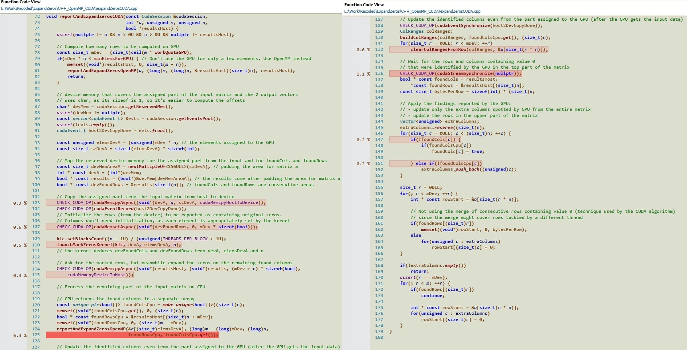

### Expanding the zeros found in a matrix on the corresponding rows and columns

* * *

Using parallelism and concurrency was the motivation behind checking this problem.

The C++ implementation provides:

- an algorithm that uses [CUDA](https://en.wikipedia.org/wiki/CUDA) to ask the GPU for finding the zeros within vertical chunks of the matrix, while the CPU updates the previously detected columns. The GPU transmits the found columns in parallel with finding new ones (There are different streams for those tasks). Updating the rows is supposed to go rather fast and is kept at the final for the CPU:  Despite the high degree of introduced parallelism, the obtained performance is inferior to the other CPU-only approaches (around 80ns per analyzed element versus the better times listed at the bottom of the page). As the profiling demonstrated, more than half from the duration of the method is spent allocating/releasing device memory, 1/4 of it the CPU is either idle (synchronizing with a certain stream) or goes into memory transfers between the host and the device. Only around 1/8 of the time is spent updating columns and rows and launching device kernels
- an [OpenMP](http://www.openmp.org/) algorithm choosing the number of threads tackling the detection of zeros (first phase) and separately, the update of the matrix (the last phase). However, the update is performed in a single row-major traversal: either an entire row or just the marked columns from that row. The update phase is also designed to prevent false sharing. Recording the identified columns keeps the false sharing to a minimum by letting each thread record locally the columns with zeros from their part of the data and then merging those local recordings together. Barriers and locks were avoided whenever possible

Empirically, the multithreading implementations perform better when each used thread has enough elements to analyze, thus there are cases when only a few busy cores are better than several more with less to do. This was more obvious for the Java implementation:

- Java: 3.5ns per analyzed element for a single thread versus 5ns per analyzed element when using 2 threads
- Python: 280ns per analyzed element for a single thread versus 300ns per analyzed element when using 2 threads
- the C++ implementation based on OpenMP shows for both cases times around 3ns per analyzed element

Next version of the [CUDA](https://en.wikipedia.org/wiki/CUDA) algorithm needs to *merge* the 3 memory areas allocated on device, so that there are less (de)allocations. Currently, the device to host transfers happen often and involve small amounts of memory. Each such transfer lets the host waiting (synchronizing with the corresponding stream). Besides, these transfers are around 100 times slower than large host to device transfers (fact observed while using a CUDA profiler). To address this problem, future kernels should produce less frequent, but larger output (device to host transfers).

* * *

&copy; 2017 Florin Tulba (florintulba@yahoo.com)