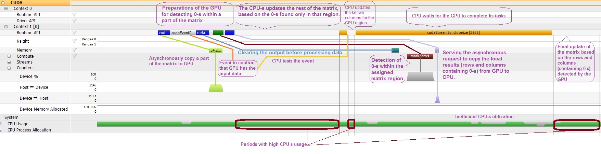

### Expanding the zeros found in a matrix on the corresponding rows and columns

* * *

Using parallelism and concurrency was the motivation behind checking this problem.

The C++ implementation provides:

- an algorithm that uses [CUDA](https://en.wikipedia.org/wiki/CUDA) to ask the GPU for finding the zeros within a horizontal chunk of the matrix, while the CPU-s update the rest of the matrix based on the zeros detected within their corresponding sub-matrix. Usually, the GPU is still behind the CPU-s at this stage (at least this happens for the tested GPU, no matter how little work the GPU receives compared to the CPU-s). This allowed to put the CPU perform also the update of the known columns from the sub-matrix assigned to the GPU. Finally, when the GPU responds with its versions of the rows and columns with zeros, the CPU can update the entire matrix for the last time. Profiling shows that only 10% of the algorithm, the CPU is idle waiting for the results from the GPU. Another time slice of 1/7 is spent programming the GPU. The rest (around 2/3 of the total duration) goes to actual processing of the matrix by the CPU-s. This approach produces times of around 7ns per analyzed element, but it is important to note that the allocation / release of memory on the device is not timed (those are quite long operations and they are performed only once for an overestimated size of the matrix). 
- an [OpenMP](http://www.openmp.org/) algorithm choosing the number of threads tackling the detection of zeros (first phase) and separately, the update of the matrix (the last phase). However, the update is performed in a single row-major traversal: either an entire row or just the marked columns from that row. The update phase is also designed to prevent false sharing. Recording the identified columns keeps the false sharing to a minimum by letting each thread record locally the columns with zeros from their part of the data and then merging those local recordings together. Barriers and locks were avoided whenever possible

Empirically, the multithreading implementations perform better when each used thread has enough elements to analyze, thus there are cases when only a few busy cores are better than several more with less to do. This was more obvious for the Java implementation:

- Java: 3.5ns per analyzed element for a single thread versus 5ns per analyzed element when using 2 threads
- Python: 280ns per analyzed element for a single thread versus 300ns per analyzed element when using 2 threads
- the C++ implementation based on OpenMP shows for both cases times around 3ns per analyzed element

Current version of the [CUDA](https://en.wikipedia.org/wiki/CUDA) algorithm addressed several previously noticed issues and reduced the required time per analyzed element from 80ns to 45ns and then to 7ns (times measured for NVIDIA GeForce 9600M GS). Now there is a single pre-allocated device memory region (The timers don&#39;t measure the duration of this operation). The amount of work for the GPU is configurable and this allowed establishing a more efficient collaboration between the CPU-s and the GPU. Profiling with Nsight shows huge delays for the execution of most asynchonous GPU commands compared to the execution speed of the CPU-s tasks: 

As a consequence, the algorithm can be configured to avoid using the GPU, especially for small matrices.

* * *

&copy; 2017 Florin Tulba (florintulba@yahoo.com)