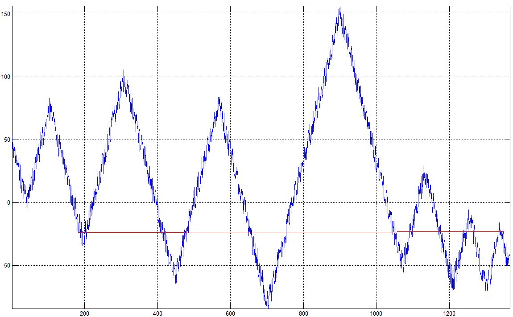
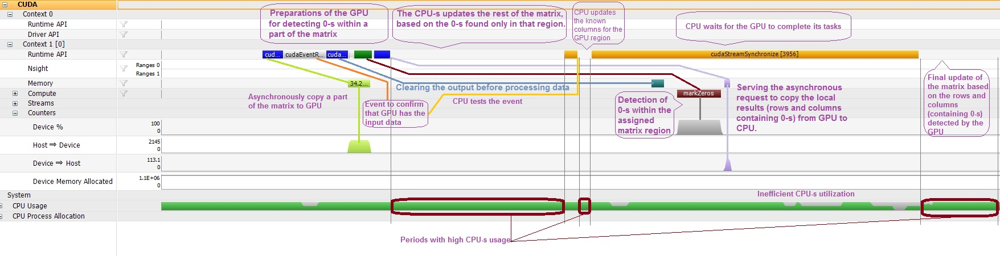

### Recoding Experiments

* * *

This is a collection of **small projects** whose *solutions* were implemented and then **rewritten (translated) in several programming languages**. The purpose of this approach is to *refresh/learn some notions from each of those languages*. The languages used so far are: *C++*, *Java*, *Matlab/Octave*, *Python*, *R*, *Prolog* and *Lisp*.

The list of the recoded projects considered so far:

- ***[CountShapes](CountShapes/)*** - a tool for counting all possible triangles and (convex) quadrilaterals from geometric figures traversed by a number of lines. Counting accuracy was mathematically checked except for the largest and most complex tested figures (one such figure appears below). *Interpreting the figures* (which allow *drawing imperfections*) was solutioned in Matlab/Octave using a few **image processing** techniques. Additionaly, this problem is quite suitable for solutions using **parallelism** (implemented so far in C++ with [OpenMP](http://www.openmp.org/)). [CUDA](https://en.wikipedia.org/wiki/CUDA)/[OpenCL](https://www.khronos.org/opencl/) could be other options for C++ parallel implementations. 

- ***[FurthestSortedPair](FurthestSortedPair/)*** - it determines the most distant pair of sorted elements within a random array with O(N log(N)) compares and using O(N) additional space. The red line from the image below connects the identified pair: 

- ***[ExpandZeros](ExpandZeros/)*** - it expands the zeros found in a matrix on the corresponding rows and columns. Implemented, studied and improved several multithreading algorithms and also a version using the GPU in parallel with the CPU (based on [CUDA](https://en.wikipedia.org/wiki/CUDA)). Below appear the findings from a Nsight profiling session:  The implementation minimizes the CPU-s idle times by splitting the work between CPU-s and GPU based on their potentials. CPU-s are in this case more powerful and they perform all the tasks which are independent from the output of the GPU. Only afterwards they wait for the contribution from the GPU
- ***[UnionFind](UnionFind/)*** - a data structure with excellent performance used to build sets of elements and for establishing if 2 items belong to the same set. More details can be found [here](https://en.wikipedia.org/wiki/Disjoint-set_data_structure)

* * *

&copy; 2017 Florin Tulba (florintulba@yahoo.com)
