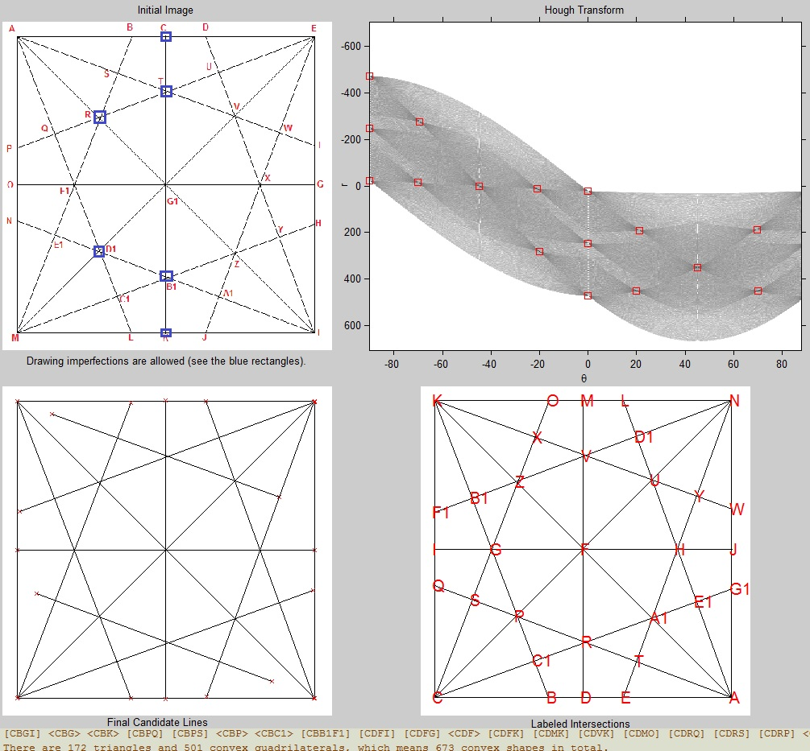

### Recoding Experiments

* * *

This is a collection of **small projects** whose *solutions* were implemented and then **rewritten (translated) in several programming languages**. The purpose of this approach is to *refresh/learn some notions from each of those languages*. The languages used so far are: *C++*, *Java*, *Matlab/Octave*, *Python*, *R*, *Prolog* and *Lisp*.

The list of the recoded projects considered so far:

- ***[CountShapes](CountShapes/)*** - a tool for counting all possible triangles and (convex) quadrilaterals from geometric figures traversed by a number of lines. Counting accuracy was mathematically checked except for the largest and most complex tested figure (which appears below). *Interpreting the figures* (which allow *drawing imperfections*) was solutioned in Matlab/Octave using a few **image processing** techniques. Additionaly, this problem seems suitable for applying **parallelism** (implemented in C++ with support from [OpenMP](http://www.openmp.org/) or [CUDA](https://en.wikipedia.org/wiki/CUDA)/[OpenCL](https://www.khronos.org/opencl/)) 

- ***[UnionFind](UnionFind/)*** - a data structure with excellent performance used to build sets of elements and for establishing if 2 items belong to the same set. More details can be found [here](https://en.wikipedia.org/wiki/Disjoint-set_data_structure)

* * *

&copy; 2017 Florin Tulba (florintulba@yahoo.com)